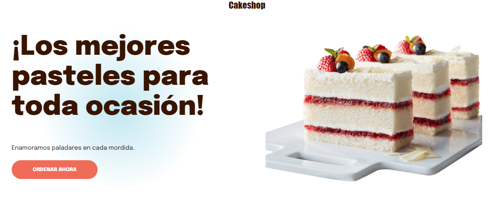

# Cakes Shop
Enamora tu paladar con los ricos pasteles que tenemos disponibles para ti.

 

## Despliegue 📦
- [Cakes Shop](https://gatc-18.github.io/Cakeshop/) 

## Stack de Tecnología 🛠️

 - React (Marco de trabajo)
 - Styled components (Diseño)
 - React-icons (iconos)

## Scripts disponibles

En el directorio principal del proyecto puedes correr desde tu terminar:

### `npm start`

Corre el aplicativo en modo Desarrollo.\
Abre [http://localhost:3000](http://localhost:3000) para verlo en tu navegador.

